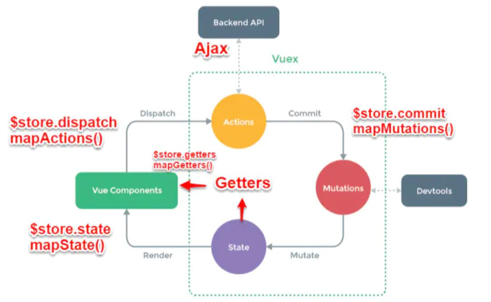

# Vue 组件间通信的六种方式
* props、$emit/$on、vuex、$parent/$children、$attrs/$listeners、provide/inject
* 常见使用场景可以分为三类：
    1. 父子通信
        1. 父向子传递数据是通过 props，子向父是通过 events（$emit）；
        2. 通过父链 / 子链 也可以通信（$parent / $children）
        3. ref 也可以访问组件实例
        4. provide / inject API
        5. $attrs / $listeners
    2. 兄弟通信
        1. Bus
        2. Vuex
    3. 跨级通信
        1. Bus
        2. Vuex
        3. provide / inject API
        4. $attrs / $listeners

## 法一、props / $emit
* 父组件 A 通过 props 的方式向子组件 B 传递，B to A 通过在 B 组件中 $emit, A 组件中 v-on 的方式实现
### 1. 父组件向子组件传值
* 父组件如何向子组件传递值：在子组件 Users.vue 中如何获取父组件 App.vue 中的数据 users:["Henry","Bucky","Emily"]
    ```html
        <!-- //App.vue父组件 -->
        <template>
            <div id="app">
                <!-- // 前者自定义名称便于子组件调用，后者要传递数据名 -->
                <users v-bind:users="users"></users>
            </div>
        </template>
        <script>
        import Users from "./components/Users"
        export default {
            name: 'App',
            data(){
                return{
                    users:["Henry","Bucky","Emily"]
                }
            },
            components:{
                "users":Users
            }
        }
    ```
    ```html
        //users子组件
        <template>
            <div class="hello">
                <ul>
                    // 遍历传递过来的值，然后呈现到页面
                    <li v-for="user in users">{{ user }}</li> 
                </ul>
            </div>
        </template>
        <script>
        export default {
            name: 'HelloWorld',
            props:{
                // 这个就是父组件中子标签自定义名字
                users:{           
                    type:Array,
                    required:true
                }
            }
        }
        </script>
    ```
* 总结：父组件通过 props 向下传递数据给子组件。注：组件中的数据共有三种形式：data、props、computed

### 2. 子组件向父组件传值（通过事件形式）
    ```html
        <!-- 子组件 -->
        <template>
        <header>
            <!-- 绑定一个点击事件 -->
            <h1 @click="changeTitle">{{title}}</h1>
        </header>
        </template>
        <script>
        export default {
            name: 'app-header',
            data() {
                return {
                    title:"Vue.js Demo"
                }
            },
            methods:{
                changeTitle() {
                    //自定义事件  传递值“子向父组件传值”
                    this.$emit("titleChanged","子向父组件传值");
                }
            }
        }
        </script>
    ```
    ```html
        // 父组件
        <template>
        <div id="app">
            <!-- 与子组件titleChanged自定义事件保持一致 -->
            <app-header v-on:titleChanged="updateTitle" ></app-header>
            <!-- updateTitle($event)接受传递过来的文字 -->
            <h2>{{title}}</h2>
        </div>
        </template>
        <script>
        import Header from "./components/Header"
        export default {
            name: 'App',
            data(){
                return{
                    title:"传递的是一个值"
                }
            },
            methods:{
                //声明这个函数
                updateTitle(e){   
                    this.title = e;
                }
            },
            components:{
                "app-header":Header,
            }
        }
        </script>
    ```
* 总结：子组件通过 events 给父组件发送消息，实际上就是子组件把自己的数据发送给父组件

## 方法二、$emit / $on
* 这种方法通过一个空的 Vue 实例作为中央事件总线（事件中心），用它来触发事件和监听事件，巧妙而轻量地实现了任何组件间的通信，包括父子、兄弟、跨级。当项目比较大时，可以选择更好的状态管理解决方案 Vuex
### 1. 具体实现方式
    ```javascript
        var Event = new Vue()
        Event.$emit(事件名,数据)
        Event.$on(事件名,data => {})
    ```
### 2. 示例
* 假设兄弟组件有三个，分别是 A、B、C 组件，C 组件如何获取 A 或者 B 组件的数据
    ```html
        <div id="itany">
            <my-a></my-a>
            <my-b></my-b>
            <my-c></my-c>
        </div>

        <template id="a">
            <div>
                <h3>A组件：{{name}}</h3>
                <button @click="send">将数据发送给C组件</button>
            </div>
        </template>

        <template id="b">
            <div>
                <h3>B组件：{{age}}</h3>
                <button @click="send">将数组发送给C组件</button>
            </div>
        </template>

        <template id="c">
            <div>
                <h3>C组件：{{name}}，{{age}}</h3>
            </div>
        </template>
        <script>
        var Event = new Vue();//定义一个空的Vue实例
        var A = {
            template: '#a',
            data() {
                return {
                    name: 'tom'
                }
            },
            methods: {
                send() {
                    Event.$emit('data-a', this.name);
            }
            }
        }
        var B = {
            template: '#b',
            data() {
                return {
                    age: 20
                }
            },
            methods: {
                send() {
                    Event.$emit('data-b', this.age);
                }
            }
        }
        var C = {
            template: '#c',
            data() {
                return {
                    name: '',
                    age: ""
                }
            },
            mounted() {//在模板编译完成后执行
                Event.$on('data-a',name => {
                    this.name = name;//箭头函数内部不会产生新的this，这边如果不用=>,this指代Event
                })
                Event.$on('data-b',age => {
                    this.age = age;
                })
            }
        }
        var vm = new Vue({
            el: '#itany',
            components: {
                'my-a': A,
                'my-b': B,
                'my-c': C
            }
        });	
        </script>
    ```

## 方法三、Vuex

### 1. Vue原理
* Vuex 实现了一个单向数据流，在全局拥有一个 State 存放数据，当组件要更改 State 中的数据时，必须通过 Mutation 进行，Mutation 同时提供了订阅者模式供外部插件调用获取 State 数据的更新。而当所有异步操作（常见于调用后端接口异步获取更新数据）或批量的同步操作需要走 Action，但 Action 也是无法直接修改 State 的，还是需要通过 Mutation 来修改 State 的数据。最后根据 State 的变化，渲染到视图上。

### 2. 各模块的功能
1. Vue Components：Vue 组件，在 HTML 页面上，负责接收用户操作等交互行为，执行 dispatch 方法触发对应 action 进行回应。
2. dispatch：操作行为触发方法，是唯一能执行 action 的方法
3. actions：操作行为处理模块，由组件中的 $store.dispatch('action 名称', data) 来触发。然后由 commit() 来触发 mutation 的调用，间接更新 state。负责处理 Vue Components 接收到的所有交互行为。包含同步/异步操作，支持多个同名方法，按照注册的顺序依次触发。向后台 API 请求的操作就在这个模块中进行，包括触发其它 action 以及提交 mutation 的操作。该模块提供了 Promise 的封装，以支持 action 的链式触发
4. commit：状态改变提升操作方法。对 mutation 进行提交，是唯一能执行 mutation 的方法
5. mutations：状态改变操作方法，由 actions 中的 commit('mutation 名称') 来触发。是 Vuex 修改 state 的唯一推荐方法。该方法只能进行同步操作，且方法名只能全局唯一。操作之中会有一些 hook 暴露出来，以进行 state 的监控等
6. state：页面状态管理容器对象。集中存储 Vue components 中 data 对象的零散数据，全局唯一，以统一的状态管理。页面显示所需的数据从该对象中进行读取，利用 Vue 的细粒度数据响应机制来进行高效的状态更新
7. getter：state 对象读取方法。被包含在 render 中，Vue Components 通过该方法读取全局 state 对象

### 3. Vuex 与 localStorage
* Vuex 是 vue 的状态管理器，存储的数据是响应式的。但是并不会保存起来，刷新之后就回到初始状态，具体的做法应该在 vuex 里数据改变的时候把数据拷贝一份保存到 localStorage 里面，刷新之后，如果 localStorage 里有保存的数据，取出来再替换 store 里的 state
    ```javascript
        let defaultCity = "上海"
        try {   // 用户关闭了本地存储功能，此时在外层加个try...catch
            if (!defaultCity){
                defaultCity = JSON.parse(window.localStorage.getItem('defaultCity'))
            }
        }catch(e){}

        export default new Vuex.Store({
            state: {
                city: defaultCity
            },
            mutations: {
                changeCity(state, city) {
                state.city = city
                try {
                window.localStorage.setItem('defaultCity', JSON.stringify(state.city));
                // 数据改变的时候把数据拷贝一份保存到localStorage里面
                } catch (e) {}
                }
            }
        })
    ```
* 注意：由于 Vuex 里保存的状态都是数组，而 localStorage 只支持字符串，所以需要用 JSON 转换
    ```javascript
        JSON.stringify(state.subscribeList);   // array -> string
        JSON.parse(window.localStorage.getItem("subscribeList"));    // string -> array 
    ```

## 方法四、$attrs / $listeners
### 1. 简介
* 多级组件嵌套需要传递数据时，通常使用的方法是通过 Vuex。但如果仅仅是传递数据，而不做中间处理，使用 vuex 处理，显得有点麻烦。故使用 $attrs / $listeners
    * $attrs：包含了父作用域不被 prop 所识别（且获取）的特性绑定（class 和 style 除外）。当一个组件没有声明任何 prop 时，这里会包含所有父作用域的绑定（class 和 sytle 除外），并且可以通过 v-bind="$attrs" 传入内部组件。通常配合 inheritAttrs 选项一起使用
    * $listeners：包含了父作用域中的 (不含 .native 修饰器的) v-on 事件监听器。它可以通过 v-on="$listeners" 传入内部组件
* 例子：（跨级通信）
    ```html
        <!-- index.vue -->
        <template>
        <div>
            <h2>浪里行舟</h2>
            <child-com1
                :foo="foo"
                :boo="boo"
                :coo="coo"
                :doo="doo"
                title="Evildoer98"
            ></child-com1>
        </div>
        </template>
        <script>
        const childCom1 = () => import("./childCom1.vue");
        export default {
            components: { childCom1 },
            data() {
                return {
                    foo: "Javascript",
                    boo: "Html",
                    coo: "CSS",
                    doo: "Vue"
                };
            }
        };
        </script>
    ```
    ```html
        <!-- childCom1.vue -->
        <template class="border">
        <div>
            <p>foo: {{ foo }}</p>
            <p>childCom1的$attrs: {{ $attrs }}</p>
            <child-com2 v-bind="$attrs"></child-com2>
        </div>
        </template>
        <script>
        const childCom2 = () => import("./childCom2.vue");
        export default {
            components: {
                childCom2
            },
            // 可以关闭自动挂载到组件根元素上的没有在props声明的属性
            inheritAttrs: false, 
            props: {
                // foo作为props属性绑定
                foo: String 
            },
            created() {
                console.log(this.$attrs); // { "boo": "Html", "coo": "CSS", "doo": "Vue", "title": "Evildoer98" }
            }
        };
        </script>
    ```
    ```html
        <!-- childCom2.vue -->
        <template>
        <div class="border">
            <p>boo: {{ boo }}</p>
            <p>childCom2: {{ $attrs }}</p>
            <child-com3 v-bind="$attrs"></child-com3>
        </div>
        </template>
        <script>
        const childCom3 = () => import("./childCom3.vue");
        export default {
            components: {
                childCom3
            },
            inheritAttrs: false,
            props: {
                boo: String
            },
            created() {
                console.log(this.$attrs); // { "coo": "CSS", "doo": "Vue", "title": "Evildoer98" }
            }
        };
        </script>
    ```
    ```javascript
        // childCom3.vue
        <template>
        <div class="border">
            <p>childCom3: {{ $attrs }}</p>
        </div>
        </template>
        <script>
        export default {
            props: {
                coo: String,
                title: String
            }
        };
        </script>
    ```
* $attrs表示没有继承数据的对象，格式为{属性名：属性值}。Vue2.4提供了$attrs , $listeners 来传递数据与事件，跨级组件之间的通讯变得更简单。
* 简单来说：$attrs与$listeners 是两个对象，$attrs 里存放的是父组件中绑定的非 Props 属性，$listeners里存放的是父组件中绑定的非原生事件。

## 方法五、provide/inject
### 1. 简介
* 这对选项一起使用，以允许一个祖先组件向其所有子孙后代注入一个依赖，不论组件层次有多深，并在起上下游关系成立的时间里始终生效。
* 祖先组件中通过 provide 来提供变量，然后在子组件中通过 inject 来注入变量
* provide / inject 主要解决了跨级组件间通信问题，不过它的使用场景，主要是子组件获取上级组件的状态，跨级组件间建立了一种主动提供与依赖注入的关系。

### 2. 例子
* 假设有两个组件：A.vue 和 B.vue，B 是 A 的子组件
    ```javascript
        // A.vue
        export default {
            provide: {
                name: 'Evildoer98'
            }
        }

        // B.vue
        export default {
            inject: ['name'],
            mounted () {
                console.log(this.name);  // Evildoer98
            }
        }
    ```

### 3. provide 与 inject 怎么实现数据响应式
1. provide 祖先组件的实例，然后在子孙组件中注入依赖，这样就可以在子孙组件中直接修改祖先组件的实例的属性，不过这种方法有个缺点就是这个实例上挂载很多没有必要的东西，比如 props、methods等
2. 使用最新 2.6 API Vue.Observable 优化响应式 provide

## 方法六、$parent / $children与 ref
* ref：如果在普通的 DOM 元素上使用，引用指向的就是 DOM 元素；如果用在子组件上，引用就指向组件实例
* $parent / $children：访问父 / 子实例
* 注意：这两种都是直接得到组件实例，使用后可以直接调用组件的方法或访问数据
* ref 来访问的例子：
    ```javascript
        // component-a 子组件
        export default {
            data () {
                return {
                    title: 'Vue.js'
                }
            },
            methods: {
                sayHello () {
                    window.alert('Hello');
                }
            }
        }
    ```
    ```html
        <!-- 父组件 -->
        <template>
            <component-a ref="comA"></component-a>
        </template>
        <script>
        export default {
            mounted () {
                const comA = this.$refs.comA;
                console.log(comA.title);  // Vue.js
                comA.sayHello();  // 弹窗
            }
        }
        </script>
    ```
* 这两种方法的弊端是，无法在跨级或兄弟间通信