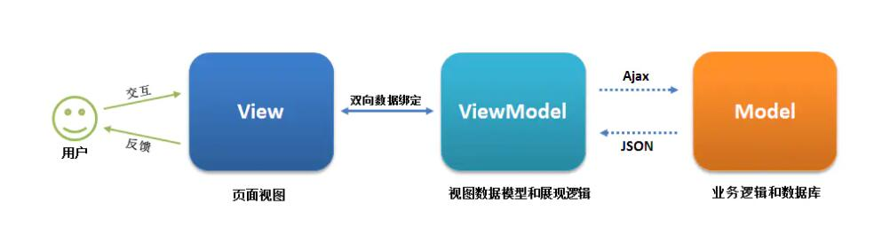
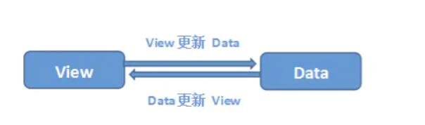
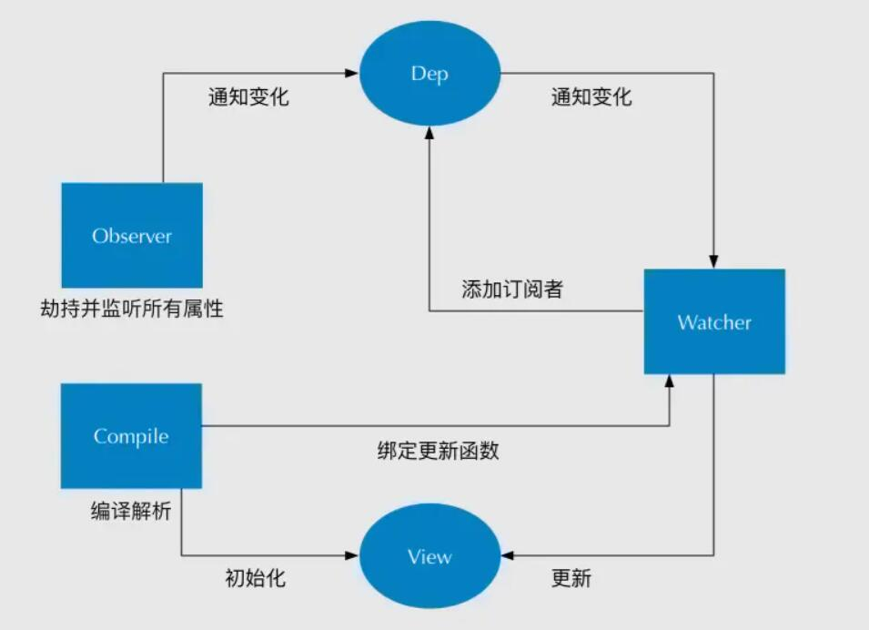

# 对 SPA 单页面的理解以及优缺点？
* SPA（single-page application）仅在 Web 页面初始化加载相应的 HTML、JavaScript 和 CSS。一旦页面加载完毕，SPA 不会因为用户的操作而进行页面的重新加载或跳转；取而代之的利用路由机制实现 HTML 内容的交换，UI 与用户的交互，避免页面的重新加载。
* 优点：
    1. 用户体验好、快，内容的改变不需要重新加载整个页面，避免了不必要的跳转的重复渲染
    2. SPA 相对服务器压力小
    3. 前后端职责分离，架构清晰，前端进行交互逻辑，后端负责数据处理
* 缺点：
    1. 初次加载耗时多：为实现单页 Web 应用功能及显示效果，需要在加载页面的时候将 JavaScript、CSS 统一加载，部分页面按需加载
    2. 前进后退路由管理：由于单页应用在同一个页面中显示所有的内容，所以不能使用浏览器的前进后退功能，所有页面的切换需要自己建立堆栈管理
    3. SEO 难度较大：由于所有的内容都在一个页面中动态替换显示

# v-show 与 v-if 有什么区别？
1. v-if 是真正的条件渲染，因为它会确保在切换过程中条件块内的事件监听器和子组件适当的被销毁和重建；也是惰性的；如果在初始渲染时条件为假，则什么也不做 ———— 直到条件第一次变为真时，才会开始渲染条件块
2. v-show ———— 不管初始条件是什么，元素总是会被渲染，并且只是简单地基于 CSS 的"display:none" 属性进行切换
* v-if 适用于在运行时很少改变条件，不需要频繁切换的场景
* v-show 则适用于需要非常频繁切换条件的场景

# Class 与 Style 如何动态绑定？
* class 可以通过对象语法与数组语法进行动态绑定
    1. 对象语法
        ```javascript
            <div v-bind:class="{active: isActive, 'text-danger': hasError}"></div>
            data: {
                isActive: true,
                hasError: flase
            }
        ```
    2. 数组语法
        ```javascript
            <div v-bind:class="[isActive ? activeClass : '', errorClass]"></div>
            data: {
                activeClass: 'active',
                errorClass: 'text-danger'
            }
        ```
* style 也可以通过对象语法和数组语法进行动态绑定
    1. 对象语法
        ```javascript
            <div v-bind:style="{color: activeColor, fontSize: fontsize + 'px'}"></div>
            data: {
                activeColor: 'red',
                fontSize: 30
            }
        ```
    2. 数组语法
        ```javascript
            <div v-bind:style="[styleColor, styleSize]"></div>
            data: {
                styleColor: {
                    color: 'red'
                },
                styleSize: {
                    fontSize: '30px'
                }
            }
        ```

# Vue 的单向数据流
* 所有的 prop 都使得其父子 prop 之间形成了一个单向下行绑定：父级 prop 的更新会向下流动到子组件中，但是反过来则不行。这样防止从子组件意外改变父级组件的状态，从而导致应用数据流向难以理解。
* 每次父级组件发生更新时，子组件中所有的 prop 都会刷新为最新的值。
* 子组件要想修改，只能通过 $emit 派发一个自定义事件，父组件接收到后，由父组件修改
* 两种常见的修改 prop 情形
    1. 这个 prop 用来传递一个初始值，这个子组件接下来希望将其作为一个本地的 prop 数据来使用。在这种情况下，最好定义一个本地的 data 属性并将这个 prop 用作其初始值
        ```javascript
            prop: ['initialCounter'],
            data: function () {
                return {
                    counter: this.initialCounter
                }
            }
        ```
    2. 这个 prop 以一种原始的值传入且需要进行叫唤，这种情况下，最好使用 prop 的值来定义一个计算属性
        ```javascript
            prop: ['size'],
            computed: {
                normalizedSize: function () {
                    return this.size.trim().toLowerCase()
                }
            }
        ```

# Vue 组件间通信有哪几种方式
1. props / $emit 适用于 父子组件通信
2. ref 与 $parent / $children 适用 父子组件通信
    * ref：如果在普通函数的 DOM 元素上使用，引用指向的就是 DOM 元素；如果用在子组件上，引用就指向组件实例
    * $parent / $children：访问父/子实例
3. EventBus（$emit/ $on）适用于 父子、隔代、兄弟组件通信
    * 通过一个空的 Vue 实例作为中央事件总线（事件中心），用它来触发事件和监听事件，从而实现任何组件间的通信，包括父子、隔代、兄弟组件
4. $attrs / $listeners 适用于隔代组件通信
    * $attrs: 包括了父作用域不被 prop 所识别（且获取）的特性绑定（class 和 style 除外）。当一个组件没有声明任何 prop 时，这里会包括所有父作用域的绑定（class 和 style 除外），并且可以通过 v-bind="$attrs" 传入内部组件。通常配合 inheritAttrs 选项一起使用
    * $listeners：包含了父作用域中的（不含 .native 修饰器的）v-on 事件监听器。它可以通过 v-on="$listeners" 传入内部组件
5. provide / inject 适用于隔代组件通信
    * 祖先组件中通过 provider 来提供变量，然后在子孙组件中提供 inject 来注入变量。provide / inject API 主要解决了跨级组件间的通信问题，不过它的使用场景，主要是子组件获取上级组件的状态，跨级组件间建立了一种主动提供与依赖注入的关系
6. Vuex 适用于父子、隔代、兄弟组件通信
    * Vuex 是一个专门为 Vue.js 应用程序开发的状态管理模式。每一个 Vuex 的应用的核心就是 store（仓库）。"store" 基本上就是一个容器，它包含着应用中大部分的状态（state）
        1. Vuex 的状态存储是响应式的。当 Vue 组件从 store 中读取状态的时候，若 store 中的状态发生变化，那么相应的组件也会相应地得到高效更新
        2. 改变 store 中的状态的唯一途径就是显式地提交（commit）mutation。使得方便追踪每一个状态的变化
    * 主要包括以下模块：
        1. State：定义了应用状态的数据结构，可以在这里设置默认的初始状态
        2. Getter：允许组件从 Store 中获取数据，mapGetters 辅助函数仅仅是将 store 中的 getter 映射到局部计算属性
        3. Mutation：是唯一更改 store 中状态的方法，且必须是同步函数
        4. Action：用于提交 mutation，而不是直接变更状态，可以包含任意异步操作
        5. Module：允许将单一的 store 拆分为多个 store 且同时保存在单一的状态树中
        
# computed 和 watch 的区别和运用的场景？
* computed: 是计算属性，依赖其它属性值，并且 computed 的值有缓存，只有它依赖的属性值发生改变，下一次获取 computed 的值时才会重新计算 computed 的值
* watch：更多的是观察的作用，类似于某些数据的监听回调，每当监听的数据变化时都会执行回调进行后续操作
* 运用场景：
    1. 当需要进行数值计算，并且依赖于其它数据时，应该使用 computed，因为可以利用 computed 的缓存特性，避免每次获取值时，都要重新计算
    2. 当需要在数据变化时执行异步或开销较大的操作时，应该使用 watch，使用 watch 选项允许执行异步操作（访问一个 API），限制执行该操作的频率，并在得到最终结果前，设置中间状态。

# 直接给一个数组项赋值，Vue 能检测到变化吗？
* 由于 JavaScript 的限制，Vue 不能检测到以下数组的变动：
    1. 当利用索引直接设置一个数组项时
        eg：vm.items[indexOfItem] = newValue
    2. 当修改数组的长度时
        eg：vm.items.length = newLength
* 解决第一个问题，Vue 提供了一下操作方法：
    ```javascript
        // Vue.set
        Vue.set(vm.items, indexOfItem, newValue)
        // vm.$set，Vue.set 的一个别名
        vm.$set(vm.items, indexOfItem, newValue)
        // Array.prototype.splice
        vm.items.splice(indexOfItem, 1, newValue)
    ```
* 解决第二个问题，Vue 提供了一下操作方法
    ```javascript
        // Array.prototype.splice
        vm.items.splice(newLength)
    ```

# 生命周期
1. Vue 实例有一个完整的生命周期
    
    * 开始创建、初始化数据、编译模板、挂载 DOM -> 渲染、更新 -> 渲染、卸载等一系列操作
2. 各个生命周期的作用
    1. beforeCreate()
        * 是 new Vue() 之后触发的第一个钩子，在当前阶段 data、methods、computed 以及 watch 上的数据和方法都不能被访问
    2. Create()
        * 在实例创建完成之后发生，在当前阶段已经完成了数据观测，也就是可以使用数据，更改数据，在这里更改数据不会触发 updated 函数。可以做一些数据的获取，在当前阶段无法与 DOM 进行交互，如果要，则可以通过 vm.$nextTick 来访问DOM
    3. beforeMounted
        * 发生在挂载之前，在这之前 template 模板已导入渲染函数编译，而当前阶段虚拟 Dom 创建完成，即将开始渲染，在此时可以更改数据，不会触发 Updated
    4. Mounted
        * 在挂载完成后发生，在当前阶段，真实的 Dom 挂载完毕，数据完成双向绑定，可以访问 Dom 节点，使用 $refs 属性对 Dom 进行操作
    5. beforeUpdate
        * 发生在更新之前，也就是响应式数据发生更新，虚拟 Dom 重新渲染之前被触发，可以在当前阶段更改数据，不会造成重污染
    6. Updated
        * 发生在更新完成之后，当前组件 Dom 已经更新完成。注意在此阶段避免更改数据，因为这可能导致无限循环的更新
    7. beforeDestroy
        * 发生在销毁实例之前，在当前阶段实例完全可以被使用，我们可以在此阶段进行收尾工作，例如清除定时器
    8. Destroyed
        * 发生在实例销毁之后，这个时候只剩下了dom空壳，组件已经被拆解，数据绑定被卸载，监听被移除，子实例也统统被销毁

# Vue 的父组件和子组件生命周期钩子函数执行顺序（4类）
1. 加载渲染过程
    * 父 beforeCreate -> 父 Created -> 父 beforeMount -> 子 beforeCreate -> 子 Created -> 子 beforeMount -> 子 mounted -> 父 mounted
2. 子组件更新过程
    父 beforeUpdate -> 子 beforeUpdate -> 子 updated -> 父 updated
3. 父组件更新过程
    父 beforeUpdate -> 父 updated
4. 销毁过程
    父 beforeDestroy -> 子 beforeDestroy -> 子 destroyed -> 父 destroyed

# 在哪个生命周期内调用异步请求
* 可以在钩子函数 created、beforeMount、mounted 中调用，因为在这三个钩子函数中，data 已经创建，可以将服务端返回的数据进行赋值。
* 在 created 钩子函数中调用异步请求的好处：
    1. 能更快获取到服务端数据，减少页面 loading 时间
    2. ssr 不支持 beforeMount、mounted 钩子函数，所以放在 created 中有助于一致性

# 在什么阶段才能访问操作 DOM ？
* 在钩子函数 mounted 被调用前，Vue 已经将编译好的模板挂载到页面上，所以在 mounted 中可以访问操作 DOM。

# 父组件可以监听到子组件的生命周期吗？
* eg：父组件 parent 和 子组件 child，如果父组件监听到子组件挂载 mounted 就做一些逻辑处理
    ```javascript
        // parent.vue
        <child @mounted = "dosomething" />

        // child.vue
        mounted() {
            this.$emit("mounted")
        }
    ```
    * 以上需要手动通过 $emit 触发父组件的事件
* eg：在父组件引用子组件时通过 @hook 来监听即可
    ```javascript
        // parent.vue
        <child @hook:mounted = "dosomething"/>
        dosomething () {
            console.log('父组件监听到 mounted 钩子函数')
        }

        // child.vue
        mounted () {
            console.log('子组件触发 mounted 钩子函数')
        }

        // 输出顺序：
        // 子组件触发 mounted 钩子函数
        // 父组件监听到 mounted 钩子函数
    ```
    * @hook 方法不仅仅可以监听 mounted，其它生命周期事件也可以监听，例如：created、updated 等都可以被监听

# keep-alive
* keep-alive 是 Vue 内置的一个组件，可以使被包含的组件保留状态，避免重新渲染
    1. 一般结合路由和动态组件一起使用，用于缓存组件
    2. 提供 include 和 exclude 属性，两者都支持字符串或正则表达式，include 表示只有名称匹配的组件会被缓存，exclude 表示任何名称匹配的组件都不会被缓存，其中 exclude 的优先级比 include 高
    3. 对应两个钩子函数 activated 和 deactivated，当组件被激活时，触发钩子函数 activated；当组件被移除时，触发钩子函数 deactivated

# 组件 data 为什么是一个函数
```javascript
    // data
    data() {
        return {
            message: '子组件',
            childrenName: this.name
        }
    }
    // new Vue
    new Vue({
        el: '#app',
        router,
        template: '<App/>',
        components: {App}
    })
```
* 因为组件是用来复用的，且 JS 里对象是引用关系
    * 如果组件中 data 是一个对象，那么这样作用域没有隔离，子组件中的 data 属性值会相互影响
    * 如果组件中 data 选项是一个函数，那么每个实例可以维护一份被返回对象的独立的拷贝，组件实例之间的 data 属性值不会相互影响
    * new Vue 的实例，是不会被复用的，因此不存在引用对象的问题

# v-model 的原理
* vue 项目中主要使用 v-model 指令在表单 input、textarea、select 等元素上创建双向数据绑定，v-model 在内部为不同的输入元素并抛出不同的事件
    1. text 和 textarea 元素使用 value 属性和 input 事件
    2. checkbox 和 radio 使用 checked 属性和 change 事件
    3. select 字段将 value 作为 prop 并将 change 作为事件
* 以 input 表单元素为例：
    ```javascript
        <input v-model="something">
        // 相当于
        <input v-bind:value="something" v-on:click="something=$event.target.value">
    ```
* 如果在自定义组件中，v-model 默认会利用名为 value 的 prop 和名为 input 的事件
    ```javascript
        // 父组件
        <ModelChild v-model="message"></ModelChild>
        // 子组件
        <div>{{value}}</div>

        props: {
            value: String
        },
        methods: {
            test(){
                this.$emit('input', 'Evildoer98')
            }
        }
    ```

# SSR
* Vue.js 是构建客户端应用程序的框架。默认情况下，可以在浏览器中输入 Vue 组件，进行生成 DOM 和操作 DOM。然而，也可以将同一个组件渲染为服务端的 HTML 字符串，将它们直接发送到浏览器，最后将这些静态标记"激活"为客户端上完全可交互的应用程序。
    * 即：SSR 就是 Vue 在客户端将标签渲染成的整个 HTML 片段的工作在服务端完成，服务端形成的 HTML 片段直接返回给客户端这个过程就叫做服务端渲染。
* 优点：
    1. 更好的 SEO：因为 SPA 页面的内容是通过 Ajax 获取，而搜索引擎爬取工具并不会等待 Ajax 异步完成后再抓取页面内容，所以在 SPA 中是抓取不到页面通过 Ajax 获取到的内容；而 SSR 是直接由服务端返回已经渲染好的页面（数据已经包含在页面中），所以搜索引擎爬取工具可以抓取渲染好的页面
    2. 更快的内容到达时间（首屏加载更快）：SPA 会等待所有 Vue 编译后的 js 文件都下载完成后，才开始进行页面的渲染，文件下载等需要一定的时间等，所以首屏渲染需要一定的时间；SSR 直接由服务器渲染好页面直接返回显示，无需等待下载 js 文件及再去渲染等，所以 SSR 有更快的内容到达时间
* 缺点：
    1. 更多的开发条件限制：例如服务端渲染只支持 beforeCreate 和 created 两个钩子函数，这会导致一些外部扩展库需要特殊处理，才能在服务端渲染应用程序中运行；并且与可以部署在任何静态文件服务器上的完全静态单页面应用程序 SPA 不同，服务端渲染应用程序，需要处于 Node.js Server 运行环境
    2. 更好的服务器负载：在 Node.js 中渲染完整的应用程序，显然会比仅仅提供静态文件的 server 更加大量占用 CPU 资源（CPU-intensive - CPU密集）。如果在高流量环境（high traffic）下使用，准备响应的服务器负载，并明智地采用缓存策略

# Vue-router 路由模式
* vue-router 有 3 种路由模式：hash、history、abstract
    ```javascript
        switch (mode) {
            case 'history': 
                this.history = new HTML5History(this, options.base)
                break
            case 'hash':
                this.history = new HashHistory(this, options.base, this.fallback)
                break
            case 'abstract'
                this.history = new AbstractHistory(this, options.base)
                break
            default:
                if (process.env.NODE_ENV !== 'production') {
                    assert(false, `invalid mode: ${mode}`)
                }
        }
    ```
    1. hash：使用 URL hash 值来作路由。支持所有浏览器，包括不支持 HTML5 History Api 的浏览器
    2. history：依赖 HTML5 History API 和 服务器配置，具体可以查看 HTML5 History 模式
    3. abstract：支持所有 JavaScript 运行环境，如 Node.js 服务端。如果发现没有浏览器的 API，路由会自动强制进入这个模式

# vue-router 中的 hash 和 history 路由模式的原理
## hash 模式的实现原理
* location.hash 的值就是 URL 中 # 后面的内容
    https://www.word.com#search
* hash 路由模式实现的主要是基于以下特性
    1. URL 中 hash 值只是客户端的一种状态，也就是说向服务器端发出请求时，hash 部分不会被发送
    2. hash 值的改变，都会在浏览器的访问历史中增加一个记录。因此我们能通过浏览器的回退、前进按钮控制 hash 的切换
    3. 可以通过 a 标签，并设置 href 属性，当用户点击这个标签后，URL 的 hash 值会发生变化；或者使用 JavaScript 来对 location.hash 进行赋值，改变 URL 的hash 值
    4. 可以使用 hashchange 事件来监听 hash 值的变化，从而对页面进行跳转（渲染）
## history 模式的实现原理
* HTML5 提供了 History API 来实现 URL 的变化，其中做最主要的 API 有以下两个：hash.pushState() 和 history.replaceState()。这两个 API 可以在不进行刷新的情况下，操作浏览器的历史记录。唯一不同的是，前者是新增一个历史记录，后者是直接替换历史记录
    ```javascript
        window.history.pushState(null, null, path)
        window.history.replaceState(null, null, path)
    ```
* history 路由模式的实现主要基于以下特性
    1. pushState 和 replaceState 两个 API 来操作实现 URL 的变化
    2. 可以使用 popstate 事件来监听 url 的变化，从而对页面进行跳转（渲染）
    3. history.pushState() 或者 history.replaceSatate() 不会出发 popstate 事件，需要手动触发页面跳转（渲染）

# 什么是 MVVM？
* MVVM 的核心是 ViewModel 层，它就是像是一个中转站（value converter），负责转换 Model 中数据对象来让数据变得更容易管理和使用，该层向上与视图层进行双向数据绑定，向下与 Model 层通过接口请求进行数据交互，起承上启下作用

1. View 层
    * View 是视图层，也就是用户界面。前端主要由 HTML 和 CSS 来构建
2. Model 层
    * Model 是指数据模型，泛指后端进行的各种业务逻辑处理和数据操控，对于前端来说就是后端提供的 api 接口
3. ViewModel 层
    * ViewModel 是由前端开发人员组织生成和维护的视图数据层。在这一层，前端开发者对后端获取的 Model 数据进行转换处理，做二次封装，以生成符合 View 层使用预期的视图数据模型。
    * ViewModel 所封装出来的数据模型包括视图的状态和行为两个部分
    * MVVM 框架实现了双向绑定，这样 ViewModel 的内容会实时展现在 View 层，只需要处理和维护 ViewModel，更新数据视图就会自动得到相应更新。这样 View 层展现的不是 Model 层的数‘’据，而是 ViewModel 的数据，由 ViewModel 负责与 Model 层交互，就完全解耦了 View 层和 Model 层，是前后端分离方案的关键
* eg 
    ```javascript
        // View 层
        <div id="app">
            <p> {{message}} </p>
            <button v-on:click = "showMessage()">Click</button>
        </div>

        // ViewModel 层
        var app = new Vue({
            el: '#app',
            data: {
                message: 'Hello Evildoer98'
            },
            methods: {
                showMessage() {
                    let vm = this
                    alert(vm.message)
                }
            },
            created() {
                let vm = this
                // Ajax 获取 Model 层的数据
                ajax({
                    url: '/data/api',
                    success(res) {
                        vm.message = res
                    }
                })
            }
        }) 

        // Model 层
        {
            "url": '/data/api',
            "res": {
                "success": true,
                "name": "Evildoer98",
                "domian": "github/Evildoer98.com"
            }
        }
    ```

# Vue 数据双向绑定
* Vue 数据双向绑定主要是指：数据变化更新视图，视图变化更新数据
    
    1. 输入框内容变化时，Data 中的数据同步变化，即 View => Data 的变化
    2. Data 中的数据变化时，文本节点的内容同步变化，即 Data => View 的变化
    * 其中，View 变化更新 Data，可以通过事件监听的方式来实现，所以 Vue 的数据双向绑定的工作主要是如何根据 Data 变化更新 View
* Vue 主要通过以下四个步骤来实现数据双向绑定的
    
    1. 实现一个监听器 Observer：对数据对象进行遍历，包括子属性对象的属性，利用 Object.defineProperty() 对属性都加上 setter 和 getter。当给这个对象的某个值赋值，就会触发 setter，那么就能监听到数据变化
    2. 实现一个解析器 Compile：解析 Vue 模板指令，将模板中的变量都替换成数据，然后初始化渲染页面视图，并对每个指令对应的节点绑定更新函数，添加监听数据的订阅者，一旦数据有变动，收到通知，调用更新函数进行数据更新
    3. 实现一个订阅者 Watcher：Watcher 订阅者是 Observer 和 Compile 之间通信的桥梁，主要的任务是订阅 Observer 中的属性值变化的信息，当收到属性值变化的消息时，触发解析器 Compile 中对应的更新函数
    4. 订阅器 Dep：订阅器采用发布-订阅 设计模式，用来收集订阅者 Watcher，对监听器 Observer 和 订阅者 Watcher 进行统一管理
    
# Vue 是如何实现对象和数组的监听
* Object.defineProperty() 只能对属性进行数据劫持，不能对整个对象进行劫持，同理无法对数组进行劫持，但是在 Vue 中是能检测到对象和数组的变化
    ```javascript
        /**
         * Observe a list of Array items
         */
         observeArray (items: Array<any>) {
             for (let i = 0, l = items.length; i < l; i++) {
                 observe(items[i]) // observe 功能为检测数据的变化
             }
         }

         /**
          * 对属性进行递归遍历
          */
          let childOb = !shallow && observe(val) // observe 功能为检测数据的变化
    ```
* 通过 Vue 部分源码可知， Vue 是通过遍历数组和递归对象，从而达到利用 Object.defineProperty() 也能对对象和数组（部分方法的操作）进行监听

# Proxy 与 Object.defineProperty 
## Proxy
1. Proxy 可以直接监听对象而非属性
2. Proxy 可以直接监听数组的变化
3. Proxy 有多达 13 种拦截方法，不限于 apply、ownKeys、deleteProperty、has 等等是 Object.defineProperty 不具备的
4. Proxy 返回的是一个新对象，可以只操作新的对象达到目的，而 Object.defineProperty 只能遍历对象属性直接修改

## Object.defineProperty
* 兼容性好，而与 Proxy 的存在浏览器兼容性问题，无法使用 polyfill 磨平

# 
