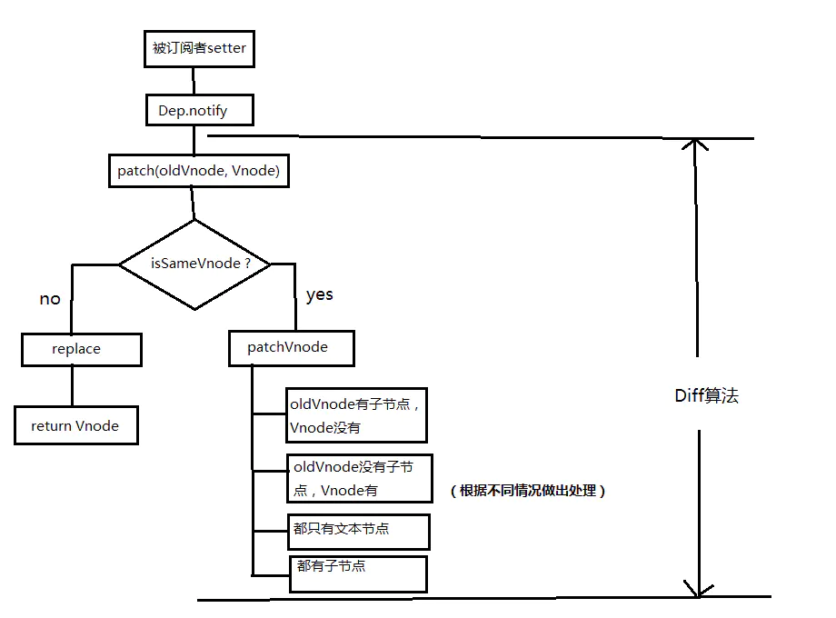

# 1. 当数据发生变化时，vue 是怎么更新节点的？
* 根据真实 DOM 生成一颗 virtual DOM，当 virtual DOM 某个节点的数据改变后会生成一个新的 Vnode，然后 Vnode 和 oldVNode 作对比，发现有不一样的地方就直接修改在真实的 DOM 上，然后使 oldVnode 的值为 Vnode
* diff 的过程就是调用名为 patch 的函数，比较新旧节点，一边比较一边给真实的 DOM 打补丁

# 2. virtual DOM 和真实 DOM 的区别？
* virtual DOM 是将真实的 DOM 的数据抽取出来，以对象的形式模拟树形结构，比如 dom 是这样的：
    ```html
    <div>
        <p>123</p>
    </div>
    ```
* 对应的 virtual DOM（伪代码）
    ```javascript
    var Vnode = {
        tag: 'tag',
        children: [
            {tag: 'p', text: '123'}
        ]
    }
    ```
* 注意：Vnode 和 oldVnode 都是对象

# 3. diff 的比较方式？
* 在采用 diff 算法比较新旧节点的时候，比较只会在同层次进行，不会跨层级比较
    ```html
    <div>
        <p>123</p>
    </div>

    <div>
        <span>456</span>
    </div>
    ```
# 4. diff 流程图
* 当数据发生改变时，set 方法会让调用 Dep.notify 通知所有订阅者 Watcher，订阅者就会调用 patch 给真实的 DOM 打补丁，更新相应的视图


# 5. 分析
## 1. patch
```javascript
    // 部分关键代码
    function patch (oldVnode, Vnode) {
        if (sameVnode(oleVnode, Vnode)) {
            patchVnode(oldVnode, Vnode)
        } else {
            const oEl = oldVnode.el // 当前 oldVnode 对应的真实元素节点
            let parentEle = api.parentNode(oEl) // 父元素
            createEle(Vnode) // 根据 Vnode 生成新元素
            if (parentEle !== null) {
                api.insertBefore(parentEle, Vnode.el, api.nextSibling(oEl)) // 将新元素添加进父元素
                oldVnode = null
            }
        }
        return Vnode
    }
```
* patch 函数接受两个参数 oldVnode 和 Vnode 分别代表新的节点和之前的旧节点
    * 判断两个节点是否值得比较，值得比较则执行 patchVnode
    ```javascript
        function sameVnode (a, b) {
            return (
                a.key === b.key  // key 值
                a.tag === b.tag  // 标签名
                a.isComment === b.isComment // 是否为注释节点
                // 是否都定义了 data，data 中包含一些具体信息，例如 onclick、style
                isDef (a.data) === isDef (b.data) && sameInputType (a, b) // 当标签是 <input> 的时候，type 必须相同
            )
        }
    ```
* 如果两个节点都是一样的，那么就深入检查他们的子节点。如果两个节点不一样那就说明 Vnode 完全被改变了，就可以直接替换 oldVnode
* diff 是逐层比较，如果第一层不一样就不会继续深入比较第二层了

## 2. patchVnode
* 开始比较两个节点
```javascript
    patchVnode (oldVnode, Vnode) {
        const el = Vnode.el = oldVnode.el
        let i, oldCh = oldVnode.children, ch = Vnode.children
        if (oldVnode === Vnode) return
        if (oldVnode.text !== null && Vnode.text !== null && oldVnode.text !== Vnode.text) {
            api.setTextContent (el, Vnode.text)
        } else {
            updateEle (el, Vnode, oldVnode)
            if (oldCh && ch && oldCh !== ch) {
                updateChildren (el, oldCh, ch)
            } else if (ch) {
                createEle (Vnode) // 生成 el 的 children 的 dom 节点
            } else if (oldCh) {
                api.removeChildren (el)
            }
        }
    } 
```
* 这个函数做了：
    1. 找到对应的真实 dom，称为 el
    2. 判断 Vnode 和 oldVnode 是否指向同一个对象，如果是，那么直接 return
    3. 如果他们都有文本节点并且不等于，那么将 el 的文本节点设置为 Vnode 的文本节点
    4. 如果 oldVnode 有子节点而 Vnode 没有，那么直接删除 el 的子节点
    5. 如果 oldVnode 没有子节点而 Vnode 有，则将 Vnode 的子节点真实化之后添加到 el
    6. 如果两者都有子节点，则执行 updateChildren 函数比较子节点

## 3. updateChildren
