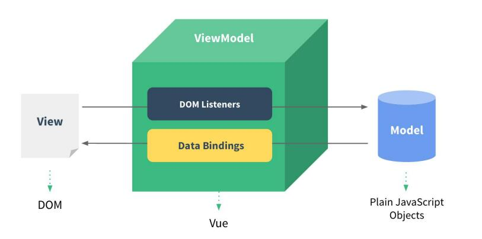

# 开始
1. 引入 Vue.js
    ```javascript
    <script type="text/javascript" src="./js/vue.js"></script>
    ```
2. 创建 Vue 对象
    * el：指定根 element（选择器）
    * data：初始化数据（页面可以访问）
    ```javascript
        const vm = new Vue({ // 配置对象 options
            // 配置选项(option)
            el: '#test',  // element: 指定用vue来管理页面中的哪个标签区域
            data: {
                msg: 'atguigu',
                test:'Evildoer98'
            }
        })
    ```
3. 双向数据绑定：v-model
    ```html
        <input type="text" v-model="msg"><!--指令--><br>
        <input type="text" v-model="test"><br>
    ```
4. 显示数据：{{xxx}}
    ```html
        <p>hello {{msg}}</p><!--大括号表达式-->
        <p>hello {{test}}</p><!--大括号表达式-->
    ```
5. 理解 Vue 的 MVVM 实现（声明式开发）
    
    1. model：模型，数据对象（data）
    2. view：视图，模板页面
        * 指令：Vue 自定义一些标签属性，都以 v- 开头，操作所在的标签
        * 大括号表达式：显示数据，读取 data 中数据显示
    3. viewmodel：视图模型（Vue 的实例）
        * 数据绑定：数据在页面与内存中的变量自动转移
            * 双向数据绑定：两个方向数据都可以自动转移
        * DOM 监听

# 模板语法
* 模板的理解：
    动态的 html 页面包含了一些 js 语法代码
        大括号表达式
        指令（以 v- 开头的自定义标签属性）
1. 双大括号表达式
    * 语法：{{content}}
        ```html
            <p>{{content}}</p> <!-- textContent -->
            <p v-text="content"></p>  <!-- textContent --> 直接打印 content 
            <p v-html="content"></p>  <!-- innerHTML --> 如果 content 是有标签结构的，则会打印标签里面的内容
            data: {
                content: '<a href="github/Evildoer98">I will Back<a/>'
            }

            打印结果：
            <a href="github/Evildoer98">I will Back<a/>
            <a href="github/Evildoer98">I will Back<a/>
            I will Back
        ```
    * 功能：向页面输出数据，可以调用对象的方法
2. 指令
    1. 强制数据绑定
        * 功能：指定变化的属性值
        * 语法：v-bind:xxx = 'yyy'  // yyy 会作为表达式解析执行
            * 简洁写法： :xxx = 'yyy' （冒号）
            ```html
                <a href="url">访问指定站点</a><br>
                <a v-bind:href="url">访问指定站点</a><br>
                <a :href="url">访问指定站点</a><br>
                data: {
                    url: 'github/Evildoer98'
                }
            ```
    2. 绑定监听事件
        * 功能：绑定指定事件名的回调函数
        * 语法：v-on:click = 'xxx'
            * 简洁写法： @click = 'xxx'
            ```html
                <button v-on:click="test">点我</button> // Hello
                <button @click="test">点我</button>  // Hello
                <button @click="test2('World')">点我</button>  // World
                <button @click="test2(content)">点我</button>  // Hello World

                data: {
                    content: 'Hello World'
                }
                methods: {
                    test () {
                        alert('Hello')
                    },
                    test2 (content) {
                        alert(content)
                    }
                }
            ```

# 计算属性和监视属性
## 计算属性
* 在 computed 属性对象中定义计算属性的方法
* 在页面中使用 {{方法名}} 来显示计算结果
    ```javascript
        姓名1: <input type="text" placeholder="Full Name1" v-model="fullName1"><br>
        <p>{{fullName1}}</p>

        computed: {
            fullName1 () { // 属性的get()，计算属性中的一个方法，方法的返回值作为属性值
                return this.firstName + '-' + this.lastName
            }
        }
    ```
* 什么时候执行：
    * 初始化显示/相关的 data 属性数据发生改变

## 监视属性
* 通过 vm 对象的 $watch() 或者 watch 配置来监视指定的属性
* 当属性变化时，回调函数自动调用，在函数内部进行计算
    ```javascript
        姓名2: <input type="text" placeholder="Full Name2" v-model="fullName2"><br>

        // 配置监视 firstName
        watch: {
            firstName: function (value) { // 相当于属性的set
                // console.log('watch firstName', value)
                // 更新 fullName2
                this.fullName2 = value + '-' + this.lastName
            }
        }

        // 监视 lastName
        vm.$watch('lastName', function (value) {
            // console.log('$watch lastName', value)
            // 更新 fullName2
            this.fullName2 = this.firstName + '-' + value
        })
    ```

## 计算属性（高级get/set）
* 通过 getter/setter 实现对属性数据的显示和监视
* 计算属性存在缓存，多次读取只执行一次 getter 计算
    ```javascript
    // 回调函数：1.自己定义的 2.没有调用 3.最后执行了
    // 回调函数：什么时候调用？用来做什么？
    // 回调函数：当需要读取当前属性值时回调，根据相关的数据计算并返回当前属性值
        computed: {
            fullName3: {
                // 当获取当前属性值时自动调用, 将返回值(根据相关的其它属性数据)作为属性值
                get () {
                // console.log('fullName3 get()')
                    return this.firstName + '-' + this.lastName
                },
                // 当属性值发生了改变时自动调用, 监视当前属性值变化, 同步更新相关的其它属性值
                set (value) { // fullName3的最新value值  A-B23
                    // console.log('fullName3 set()', value)
                    // 更新firstName和lastName
                    const names = value.split('-')
                    this.firstName = names[0]
                    this.lastName = names[1]
                }
            }
        }
    ```
